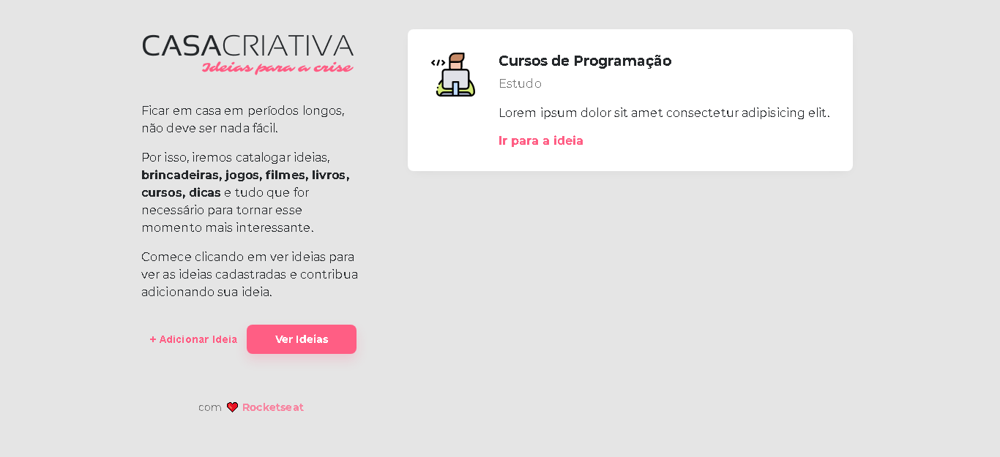

<h1 align="center">
    
</h1>

<h1 align="center" style="border-radius: 8px;">
    
</h1>

 # Sobre #

Casa criativa é Uma aplicação web criada durante o Workshopdev da Rocketseat para adicionar algumas idéias que você tenha pensado durante a pandemia

---

# Tecnologias utilizadas #

O projeto foi desenvolvido utilizando as seguintes tecnologias

- [CSS](https://developer.mozilla.org/pt-BR/docs/Web/CSS)
- [HTML](https://developer.mozilla.org/pt-BR/docs/Web/HTML)
- [JS](https://developer.mozilla.org/pt-BR/docs/Web/JavaScript)
- [Nunjucks](https://www.npmjs.com/package/nunjucks)
- [Express](https://expressjs.com/pt-br/)
- [nodeJS](https://nodejs.org/en/)
- [Sqlite3](https://www.sqlite.org/index.html)

---

Desenvolvido por [Matheus Calixto](https://www.linkedin.com/in/matheus-calixto-silva/)
